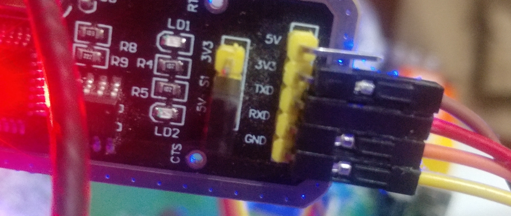
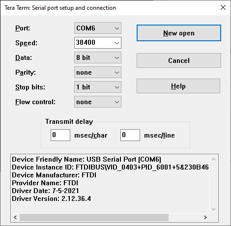
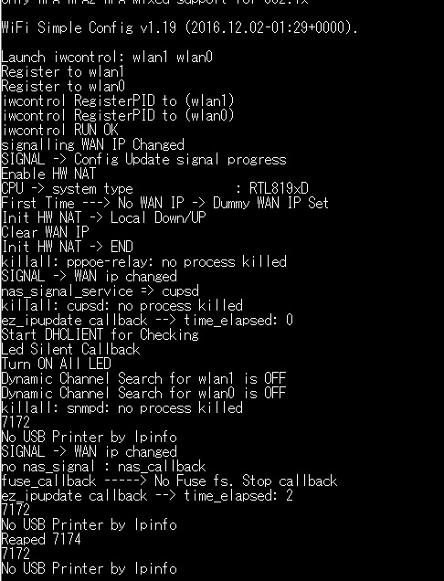

totolink-a2004ns-playground
===========================
- 
- 
- 
- 

### OpenWrt
- [[OpenWrt Wiki] TOTOLINK](https://openwrt.org/toh/hwdata/totolink/start)

### Projects
- [frederic/rtl819x-toolchain: rtl819x-toolchain-v3.2.3 - Linux SDK for ALFA AIP-W512](https://github.com/frederic/rtl819x-toolchain/)
- [vido89/Open-Wrt-RTK: rtl819xd, rtl8196e and rtl8881a](https://github.com/vido89/Open-Wrt-RTK)
- [Backdoor and RCE found in 8 TOTOLINK router models - IT Security Research by Pierre](https://pierrekim.github.io/blog/2015-07-16-backdoor-and-RCE-found-in-8-TOTOLINK-products.html)
- [15 TOTOLINK router models vulnerable to multiple RCEs - A slice of Kimchi - IT Security Blog](https://pierrekim.github.io/blog/2015-07-16-15-TOTOLINK-products-vulnerable-to-multiple-RCEs.html)
- [jacobsoo/HardwareWiki: A curated list of Hardware Hacking resources](https://github.com/jacobsoo/HardwareWiki?tab=readme-ov-file#totolink)
- [H4lo/awesome-IoT-security-article: Collect some iot-related security articles, including vulnerability analysis, security conferences and papers, etc.](https://github.com/H4lo/awesome-IoT-security-article)

### Tutorials
- [倒霉蛋的totolink学习手记 - Hexo](https://www.korey0sh1.fun/2023/07/12/%E5%80%92%E9%9C%89%E8%9B%8B%E7%9A%84totolink%E5%AD%A6%E4%B9%A0%E6%89%8B%E8%AE%B0/)
- [Flashing via serial interfaces - FIX bricked router #1 - YouTube](https://www.youtube.com/watch?v=d3gIT2hKzvY&pp=ygUMcm91dGVyIHVzYXJ0)
- [Flash IC Firmware Head Unit DHD DHD-9818 C200MB-V1.1-2018.11.24 HYB070DD 00351801 2019/03/20 Kendari - YouTube](https://www.youtube.com/watch?v=x6TMAVmWRJY)
- [Backup Firmware Router TOTOLINK A2004NS V4.0 04281B REALTEK RTL8197DN RTL8367RB RTL8192ER RTL8812AR - YouTube](https://www.youtube.com/watch?v=06VVGkIj2Q0)
- [Backup Firmware Router TOTOLINK A2004NS V4.0 04281B REALTEK RTL8197DN RTL8367RB RTL8192ER RTL8812AR - YouTube](https://www.youtube.com/shorts/1UWfkjUJ8zw)
- [Rooting My Router [Part 1] - Dumping Firmware Through UART - YouTube](https://www.youtube.com/watch?v=NF28QHlAxTM)
- [ACER Aspire 3 A314-32 Series A314-32-C52Q N17Q4 DA0Z8GMB8F0 REV.F Pare Pare - YouTube](https://www.youtube.com/watch?v=rpQOrKvyKlg)
